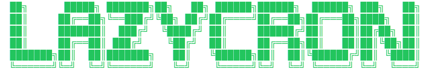

<div align="center">

<br>



<br>

**A terminal UI for managing cron jobs — locally and over SSH.**

[](https://github.com/seanhalberthal/lazycron/releases/latest)
[](https://go.dev)
[](https://github.com/seanhalberthal/lazycron/actions)
[]()
[]()
[](LICENCE)

[Quick Start](#quick-start) · [Features](#features) · [Keybindings](#keybindings) · [Configuration](#configuration) · [Development](#development)

</div>

---

## Quick Start

**Homebrew:**

```bash
brew install seanhalberthal/tap/lazycron
```

**From source:**

```bash
git clone https://github.com/seanhalberthal/lazycron.git
cd lazycron
make install
```

Then run:

```bash
lazycron
```

---

## Features

**Local crontab management** — view, create, edit, enable/disable, and delete cron jobs through an interactive TUI. Jobs display human-readable schedule descriptions, next run time, and previous run time.

**Remote servers via SSH** — connect to remote hosts and manage their crontabs as if they were local. Supports key-based and password-based authentication, with passwords encrypted at rest.

**Mailbox viewer** — read local (`/var/mail`) and remote mail generated by cron job output. View, delete, and mark messages as read — all without leaving the TUI.

**Vim-style navigation** — `j`/`k` to move, `h`/`l` to switch tabs, `/` to search. Feels like home if you live in the terminal.

---

## Keybindings

### Global

| Key | Action |
|-----|--------|
| `q` / `Ctrl+C` | Quit |
| `r` | Refresh crontab |
| `?` | Toggle help |
| `Tab` | Switch focus |
| `h` / `l` | Switch tabs |

### Local Tab

| Key | Action |
|-----|--------|
| `j` / `k` / `↑` / `↓` | Navigate jobs |
| `c` | Create job |
| `e` | Edit job |
| `p` | Pause/resume job |
| `D` | Delete job |
| `Enter` | Job details |
| `/` | Search |
| `n` / `N` | Next/previous match |

### Servers Tab

| Key | Action |
|-----|--------|
| `j` / `k` / `↑` / `↓` | Navigate servers |
| `a` | Add server |
| `c` | Connect |
| `d` | Disconnect |
| `D` | Delete server |

### Mail Tab

| Key | Action |
|-----|--------|
| `j` / `k` / `↑` / `↓` | Navigate messages |
| `g` / `G` | Jump to first / last message |
| `Enter` | Read message |
| `d` | Delete message (local only) |
| `D` | Delete all messages (local only) |
| `S` | Switch source (Local / Remote) |
| `r` | Refresh mailbox |

---

## Configuration

Configuration lives in `~/.config/lazycron/`.

### App settings — `config.toml`

```toml
default_tab = "local"  # or "servers"

[theme]
active_border = "green"
inactive_border = "default"
selected_bg = "green"
selected_fg = "black"
```

### Server connections — `servers.toml`

```toml
[[servers]]
name = "prod"
host = "example.com"
port = 22
user = "deploy"
auth_type = "key"
key_path = "~/.ssh/id_ed25519"
```

Passwords are encrypted at rest using AES-GCM. If no auth method is configured, lazycron falls back to default SSH keys (`~/.ssh/id_ed25519`, `~/.ssh/id_rsa`).

---

## Development

| Command | Description |
|---------|-------------|
| `make build` | Build for current platform |
| `make build-all` | Cross-compile for Linux and macOS (amd64, arm64) |
| `make test` | Run tests with race detection |
| `make lint` | Run golangci-lint |
| `make check` | Run all checks (fmt, tidy, vet, lint, test) |
| `make install` | Install to `$GOPATH/bin` |
| `make clean` | Remove build artefacts |

<details>
<summary>Project structure</summary>

```
cmd/lazycron/          Entry point
internal/
├── config/            App configuration and theme
├── cron/              Crontab parsing, scheduling, read/write
├── gui/               TUI views, controllers, keybindings, modals
│   └── style/         Colour constants
├── mail/              Mbox mailbox parsing, reading, and management
├── ssh/               SSH client and server config management
└── types/             Shared types and version constant
testdata/              Crontab and mbox fixtures for tests
```

</details>

---

## Licence

[MIT](LICENCE)
